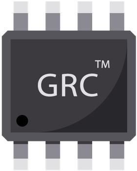
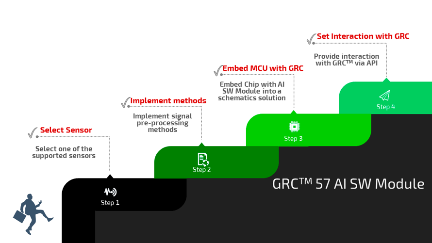
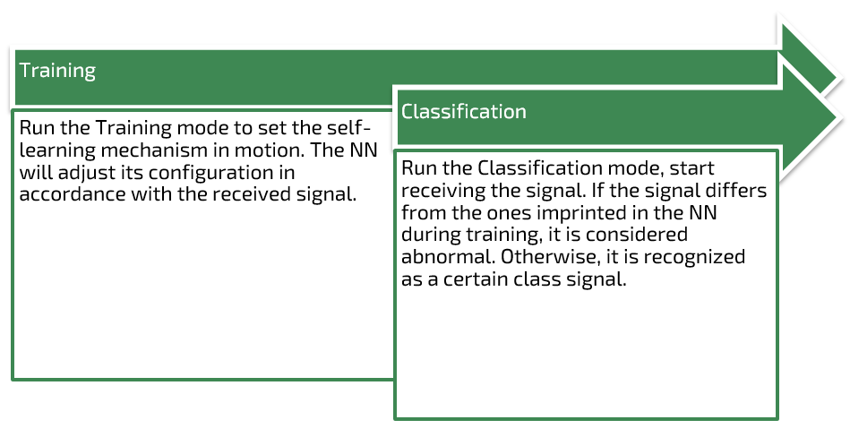

# On-Device Learning on GRC AI Module

## Purpose

Add AI functionality to a target device by embedding a chip with the pre-installed firmware.

## Features

A **self-learning engine** doing **Anomaly Detection** and **n-Class Classification** in the time series data flow for providing Full turnkey AI functionality **for integration** in products of various complexity.

* AI Module is based on the Reservoir Computing approach for providing and enhancing AI scenarios with 2 working modes:
  * **Training** mode
  * **Classification** mode
* High-performance speed in both modes: **less than 2 sec**

GRC AI Module is designed as a firmware solution for **ESP32-C3** incorporating the best features of the frontline technologies presented by Espressif and the future-oriented development approach of the Grovety experts.

* GRC AI Module utilizes all the capacities provided by ESP32-C3 FN4/H4 MCU. Basic characteristics of the MCU processors:
  * Main processor: RISC-V 32-bit microprocessor
    * Cores: 1
    * Clock frequency: up to 160 MHz
    * Performance: up to 600 DMIPS
  * Ultra low-power co-processor
* Firmware communication interfaces: I2C, SPI
* Ultra-low latency: Real-time applications
* Exchange data protocols for the chip and external devices (API)
* Non-volatile storage for data processing module

## Description

GRC AI Module is an innovative and user-friendly solution for **introducing** AI functionality to your products in **effortless** and **time-efficient** manner.
AI-based data processing offers a more flexible and powerful approach to analyzing and making decisions from large data collection. Machine learning algorithms autonomously learn patterns and relationships from the **time series data flow**.

The GRC AI Module is

* A pre-installed firmware with neural network based on the next-generation Reservoir Computing machine learning approach. It provides anomaly detection and classification of input signals in accordance with the pre-trained data.
* Intended for the use on ESP32 C3 FN4/H4 MCU, an optimal choice for AI-related scenarios and Artificial Intelligence of Things (AIoT) due to the acceleration for neural network computing and signal processing workloads provided by the SoC.

## 4 steps to get an AI-driven solution without extra expenses

Dev Board GRC serves best for developing PoC, MVP, and prototypes. **See Datasheet**.

## Perks of using GRC AI Module

* Saving time and resources at the development stage, as there is no need in
  * Development of mathematical and statistical anomaly models
  * Signal mapping and dataset preparation;
  * Training model in the cloud
* Reducing expenses for the end solution, as there is no need to spend money on
  * Data transfer from a target device
  * Storing large amounts of data
  * Support of infrastructure for processing large data amounts
* Development of autonomous solutions due to low power consumption and no need in data transfer to a server.
* Privacy and security are guaranteed as there is no need in transferring sensor signal from the target device to a server
* Vast potential of developing flexible solutions configurable to particular hardware.

## Recommended sensors

* Vibrations sensors​
* Microphones​
* Current sensors​
* Accelerometers​
* Temperature sensors​
* Other sensors which control time series data flow

## Functional Scheme

The GRC AI Module can be connected to **various platforms**, e.g. to the GRC Dev Board

Input:

* Pre-processed data flow from a sensor
* Control commands:

Output:

* Status
* Classified as:
  * Anomaly
  * Device is in mode N

## Application Domain

* Predictive maintenance
* Equipment condition monitoring
* Smart Home Systems
* Command word recognition
* Gesture recognition

## Benefits

* The easiest way to integrate AI into your system
* Save resources and development cost,
* Reach the highest performance with the ready optimized model

## Contacts

<https://grovety.com>

<hi@grovety.com>
