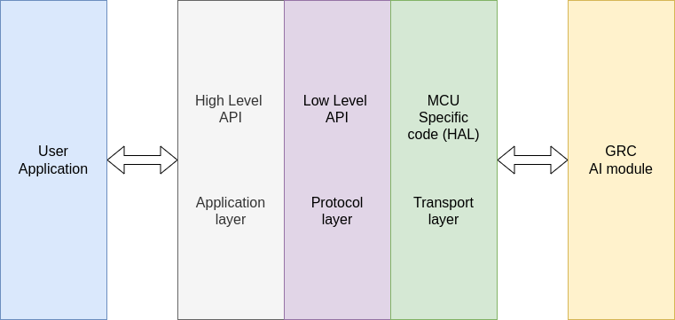

# GRC AI Module SDK Developer Guide 
/GRC_SDK/

## Overview 


GRC AI module – is a software designed to perform classification and class recognition tasks.
Functionality includes:
* AI SW on-device learning
* parameters configuration
* class recognition
* classification
* saving and loading a pre-trained model
GRC_SDK serves as a communication interface for GRC AI module over I2C bus.



GRC_SDK has several abstraction layers:
* **Transport layer** – a platform-dependent interface to work with I2C bus. It provides basic functions: configuring, reading and writing (see drivers);
* **Protocol layer** – a protocol for function remote call on GRC implemented over transport layer (see protocol_layer);
* **Application layer** – high-layer interface for calling GRC function.

## Use Cases
The basic GRC AI SW scenario includes parameter configuration, learning, and category classification based on data.

```cpp
// === 1. Driver’s Initialization ===
struct grc_ll_i2c_dev ll_dev = {
    .type = PROTOCOL_INTERFACE_I2C, //constant for selecting communication type
    .sda_io_num = <SDA PIN>,
    .scl_io_num = <SCL PIN>,
    .data_ready_io_num = <DATA READY PIN>,
    .i2c_num = <I2C PORT>,
    .clk_speed = 400000,
    .slave_addr = 0x36,
    .timeout_us = 1000
  };
struct grc_device dev = {.ll_dev = &ll_dev};
static struct grc_config arch_conf = {.arch = I3_N10_1}; // GRC AI SW architecture parameters

int result = grc_init(&dev, &arch_conf);

// === 2. Configuring GRC AI SW Parameters ===
int ai_params_len = 6;

struct hp_setup ai_params[ai_params_len];
  ai_params[0].type = PREDICT_SIGNAL;
  ai_params[0].value = 1;
  ai_params[1].type = SEPARATE_INACCURACIES;
  ai_params[1].value = 0;
  ai_params[2].type = NOISE;
  ai_params[2].value = 0.001;
  ai_params[3].type = INPUT_SCALING;
  ai_params[3].value = 0.5;
  ai_params[4].type = FEEDBACK_SCALING;
  ai_params[4].value = 0.001;
  ai_params[5].type = THRESHOLD_FACTOR;
  ai_params[5].value = 1;
result = grc_set_config(&dev, ai_params, ai_params_len);

// === 3. Preparing for Classification ===
//--- 3.a Training ---.
struct grc_training_params train_params;
train_params.flags = GRC_PARAMS_ADD_NEW_TAG;
float *train_data;
uint32_t train_data_len;
result = grc_train(&dev, &train_params, train_data, train_data_len);

// === 4. Classification ===
struct grc_inference_params inference_params;
float *inference_data;
unsigned inference_data_len;
int result_category = grc_inference(&dev, &inference_params, train_data, train_data_len);

// === 5. Clearing AI SW State===
result = grc_clear_state(&dev);

// === 6.  Driver’s De-initialization ===
result = grc_release(&dev);
```

To avoid training every time, a model can be pre-trained, and the result will be saved for further usage.

```cpp
// === 3b.1. Training and Saving a Model ===
struct grc_training_params train_params;
float *train_data;
uint32_t train_data_len;
result = grc_train(&dev, &train_params, train_data, train_data_len);
// ---------- Save in memory of the Host device ------
struct grc_internal_state *internal_states;
uint32_t internal_states_len;
result = grc_download(&dev, &internal_state, &internal_states_len);
// ---------- or in the GRC internal memory----------
result = grc_store(&dev)
Afterwards, the model can be loaded to GRC
// === 3b.2 Loading a pre-trained model ===
// ------------- from Host device memory ----------
result = grc_upload(&dev, internal_states, internal_states_len);
// ------------- or from GRC internal memory --------
result = grc_restore(&dev)
```

## Methods
### Device Configuration
### AI SW Configuration
### Detection / classification
### Information about AI SW
### Saving / Loading AI SW
## Error Codes
### Error codes at protocol layer
### Error code, which are returned by deleted functions

